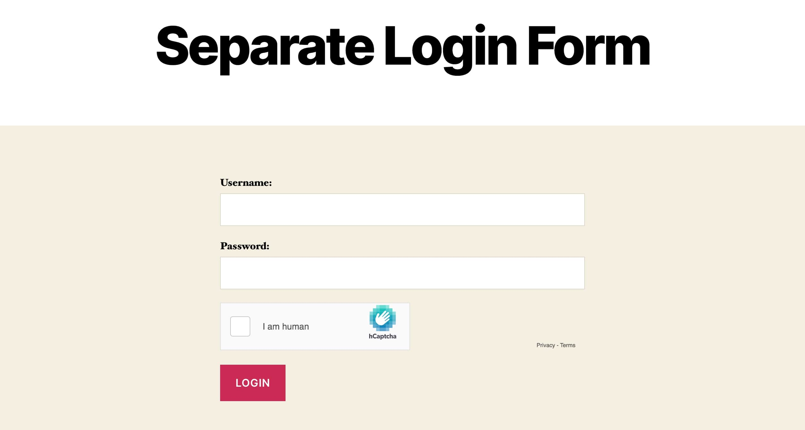

# Separate Login Form
[](https://wordpress.org/plugins/separate-login-form/)
[](LICENSE)
[](https://github.com/dcangulo/separate-login-form/pulls)
[](https://wordpress.org/support/plugin/separate-login-form/reviews/#new-post)

Display a login form with captcha on any page, post, or custom post type.

Just use the shortcode `[separate_login_form]` to display a login form.

[Please rate and review the plugin if you find it useful.](https://wordpress.org/support/plugin/separate-login-form/reviews/#new-post)

Find my other works here: [https://www.davidangulo.xyz/portfolio/](https://www.davidangulo.xyz/portfolio/)

## Installation
1. In your WordPress admin menu, hover to **Plugins** and click **Add New**.
2. Enter **Separate Login Form** in the searchbox.
3. Find the plugin entitled **Separate Login Form** by **David Angulo** then click **Install Now**.
4. Click **Activate** once the plugin is installed.

## Installation using Composer
```
composer require wpackagist-plugin/separate-login-form
```

## Bug Reports
[Open an issue.](https://github.com/dcangulo/separate-login-form/issues/new)

## Frequently Asked Questions
Do you have any question/s? You may contact me using the email [hello@davidangulo.xyz](mailto:hello@davidangulo.xyz)

## License
Copyright © 2020 David Angulo, released under the GPL2 license, see [LICENSE](LICENSE).
